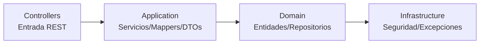

# 🏛️ Proyecto UNINPAHU – Backend en Java Spring Boot

Este proyecto implementa un sistema backend modular basado en arquitectura limpia utilizando **Java 17**, **Spring Boot**, **JWT**, **Maven** y **PostgreSQL**.  
El sistema gestiona usuarios, productos, categorías y carritos de compras, respetando principios de separación de responsabilidades.

---

# 📚 Contenido

- [Descripción general](#descripción-general)
- [Arquitectura del proyecto](#arquitectura-del-proyecto)
- [Diagramas](#diagramas)
  - [Diagrama de clases completo](#diagrama-de-clases-completo)
  - [Diagrama de capas](#diagrama-de-capas) 
- [Explicación por paquetes y clases](#explicación-por-paquetes-y-clases)
  - [Application](#1-application)
  - [Domain](#2-domain)
  - [Infrastructure](#3-infrastructure)
  - [Controllers](#4-controllers)
- [Tecnologías utilizadas](#tecnologías-utilizadas)
- [Ejecución del proyecto](#ejecución-del-proyecto)
- [Estructura completa del proyecto](#estructura-completa-del-proyecto)

---

# 🧾 1. Descripción general

Este backend implementa:

- Gestión de usuarios con roles
- Login con JWT
- CRUD de productos y categorías
- Funcionalidad de carrito de compras
- Validación y manejo de errores
- Arquitectura limpia basada en **Application → Domain → Infrastructure**

---

# 🧱 2. Arquitectura del proyecto

La arquitectura sigue el enfoque de **Clean Architecture**, estructurada en tres grandes capas:

- application → lógica de negocio, DTOs, servicios, mappers
- domain → modelos, interfaces de repositorio
- infrastructure → seguridad, excepciones, filtros, configuración
- controllers → API REST (capa de entrada)


---

# 🖼️ 3. Diagramas de clsaes


---

## **Diagrama de capas**



---

# 🔍 4. Explicación por paquetes y clases

---

## 📦 1. Application

Contiene la lógica de negocio, DTOs, mappers y servicios.

### 🧱 DTOs

#### **`CartRequestDTO`**
Representa la petición del cliente al agregar productos al carrito.

#### **`CartResponseDTO`**
Respuesta completa del carrito, incluyendo productos y cantidades.

#### **`ProductoDTO`**
Versión ligera del modelo "Producto" para evitar exponer la entidad completa.

---

### 🔄 Mappers

#### **`CartMapper`**
Se encarga de convertir:

- `Carrito` → `CartResponseDTO`  
- `Producto` → `ProductoDTO`  

---

### ⚙️ Services

#### **`CartService`**

Incluye métodos principales:

- `agregarProducto()`  
- `quitarProducto()`  
- `obtenerCarrito()`  

Depende de repositorios y del mapper.

---

## 📦 2. Domain

Capa donde residen las **entidades** y **repositorios** del modelo de negocio.

---

### 🧩 Entidades

#### **Usuario**
Atributos:

- `id`
- `nombre`
- `email`
- `password`
- `rol`

#### **Rol**
Contiene el rol del usuario (por ejemplo: `ADMIN`, `USER`).

#### **Producto**
Atributos:

- `id`
- `nombre`
- `precio`
- `categoría`

#### **Categoria**
Representa la categoría de un producto.

#### **Carrito**
Modela la relación:

Usuario — contiene → Productos


---

### 🗂️ Repositorios

#### **`RepositoryUsuario`**
Método adicional:
- `findByEmail()`

#### **`RepositoryProducto`**
Método adicional:
- `findByCategoria()`

---

## 📦 3. Infrastructure

Incluye la capa de **seguridad**, **filtros**, **configuración** y **excepciones**.

---

### 🔐 Seguridad

#### **`SecurityConfiguration`**
Configura:

- Autorización  
- Filtros  
- Endpoints públicos  

#### **`SecurityFilter`**
Intercepta y procesa peticiones:

- Extrae token  
- Valida JWT  
- Configura el contexto de seguridad  

#### **`TokenService`**
Responsable de:

- `generateToken()`
- `validateToken()`
- Manejo general del token JWT

---

### ⚠️ Excepciones

#### **`ValidacionException`**
Se utiliza para errores personalizados.

#### **`ErrorManager`**
Maneja globalmente todas las excepciones de la aplicación.

---

## 📦 4. Controllers

Controladores expuestos como API REST.

---

### 🛒 **CartController**

Endpoints:

- `POST /cart`
- `GET /cart`

---

### 📦 **ProductoController**

Endpoints:

- `GET /productos`
- `POST /productos`

---

### 👤 **UsuarioController**

Endpoints:

- `POST /login`
- `POST /register`

---

# 🛠️ 5. Tecnologías utilizadas

- **Java 17**
- **Spring Boot**
- **Maven**
- **PostgreSQL**
- **JWT (Json Web Token)**
- **Lombok**
- **JPA & Hibernate**
- **Docker**

---

# 6. Ejecución del proyecto

# 1. Clonar el repositorio

```bash
git clone https://github.com/sanntr/uninpahu.git
cd uninpahu
```
# 2. Construir el proyecto
```bash
mvn clean install
```
# 3. Ejecutar con Spring Boot
```bash
mvn spring-boot:run
```

O con Docker:
```bash
docker build -t unin-backend .
docker run -p 8080:8080 unin-backend
```
---

## 📦 7. Estructura completa del proyecto

```plaintext
uninpahu/
├── src/
│   ├── main/
│   │   ├── java/com/uninpahu/uninpahu/
│   │   │   ├── application/
│   │   │   │   ├── cart/
│   │   │   │   ├── categoria/
│   │   │   │   ├── form/
│   │   │   │   ├── negocio/
│   │   │   │   ├── producto/
│   │   │   │   └── usuario/
│   │   │   ├── controllers/
│   │   │   ├── domain/
│   │   │   │   ├── cart/
│   │   │   │   ├── categoria/
│   │   │   │   ├── form/
│   │   │   │   ├── negocio/
│   │   │   │   ├── producto/
│   │   │   │   └── usuario/
│   │   │   ├── infrastructure/
│   │   │   │   ├── exception/
│   │   │   │   └── security/
│   │   │   └── UninpahuApplication.java
│   │   └── resources/
│   │       ├── application.properties
│   │       └── db/migration/
│   └── test/
└── pom.xml
```
---

