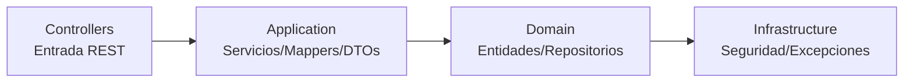

# 🏛️ Proyecto UNINPAHU – Backend en Java Spring Boot

Este proyecto implementa un sistema backend modular basado en arquitectura limpia utilizando **Java 17**, **Spring Boot**, **JWT**, **Maven** y **PostgreSQL**.  
El sistema gestiona usuarios, productos, categorías y carritos de compras, respetando principios de separación de responsabilidades.

---

# 📚 Contenido

- [Descripción general](#descripción-general)
- [Arquitectura del proyecto](#arquitectura-del-proyecto)
- [Diagramas Mermaid](#diagramas-mermaid)
  - [Diagrama de capas](#diagrama-de-capas)
  - [Diagrama de clases completo](#diagrama-de-clases-completo)
- [Explicación por paquetes y clases](#explicación-por-paquetes-y-clases)
  - [Application](#1-application)
  - [Domain](#2-domain)
  - [Infrastructure](#3-infrastructure)
  - [Controllers](#4-controllers)
- [Tecnologías utilizadas](#tecnologías-utilizadas)
- [Ejecución del proyecto](#ejecución-del-proyecto)
- [Estructura completa del proyecto](#estructura-completa-del-proyecto)

---

# 🧾 Descripción general

Este backend implementa:

- Gestión de usuarios con roles
- Login con JWT
- CRUD de productos y categorías
- Funcionalidad de carrito de compras
- Validación y manejo de errores
- Arquitectura limpia basada en **Application → Domain → Infrastructure**

---

# 🧱 Arquitectura del proyecto

La arquitectura sigue el enfoque de **Clean Architecture**, estructurada en tres grandes capas:

- application → lógica de negocio, DTOs, servicios, mappers
- domain → modelos, interfaces de repositorio
- infrastructure → seguridad, excepciones, filtros, configuración
- controllers → API REST (capa de entrada)

---

# 🖼️ Diagramas de clsaes

```mermaid
classDiagram
    %% ============================
    %% APPLICATION LAYER
    %% ============================

    class CartRequestDTO {
        +Integer productoId
        +Integer cantidad
    }

    class CartResponseDTO {
        +Integer id
        +Integer userId
        +List~ProductoDTO~ productos
    }

    class ProductoDTO {
        +Integer id
        +String nombre
        +Double precio
        +String categoria
    }

    class CartService {
        +agregarProducto()
        +quitarProducto()
        +obtenerCarrito()
    }

    class CartMapper {
        +toResponse()
    }

    CartService --> CartMapper
    CartService --> RepositoryProducto
    CartService --> RepositoryUsuario

    %% ============================
    %% DOMAIN LAYER
    %% ============================

    class Usuario {
        -Integer id
        -String nombre
        -String email
        -String password
        -Rol rol
    }

    class Rol {
        -Integer id
        -String nombre
    }

    class Producto {
        -Integer id
        -String nombre
        -Double precio
        -Categoria categoria
    }

    class Categoria {
        -Integer id
        -String nombre
    }

    class Carrito {
        -Integer id
        -Usuario usuario
        -List~Producto~ productos
    }

    class RepositoryUsuario {
        <<interface>>
        +findByEmail()
    }

    class RepositoryProducto {
        <<interface>>
        +findByCategoria()
    }

    Usuario --> Rol
    Producto --> Categoria
    Carrito --> Usuario
    Carrito --> Producto

    %% ============================
    %% CONTROLLERS
    %% ============================

    class CartController {
        +POST /cart
        +GET /cart
    }

    class ProductoController {
        +GET /productos
        +POST /productos
    }

    class UsuarioController {
        +POST /login
        +POST /register
    }

    CartController --> CartService
    ProductoController --> RepositoryProducto
    UsuarioController --> RepositoryUsuario

    %% ============================
    %% SECURITY
    %% ============================

    class SecurityConfiguration {
        +securityFilterChain()
    }

    class SecurityFilter {
        +doFilterInternal()
    }

    class TokenService {
        +generateToken()
        +validateToken()
    }

    SecurityConfiguration --> SecurityFilter
    SecurityFilter --> TokenService

    %% ============================
    %% INFRASTRUCTURE - EXCEPTIONS
    %% ============================

    class ErrorManager {
        +handleException()
    }

    class ValidacionException {
        +message
    }

```

---

## **Diagrama de capas**

---
